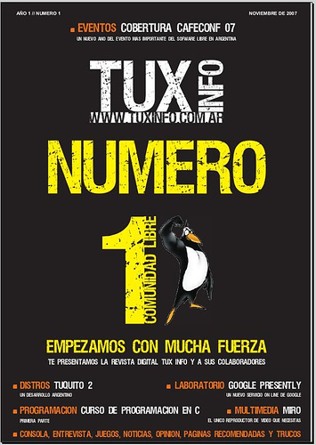

# Revistas Libres de Software Libre
{: .text-center}
{: .align-center}

## TuxInfo
<table>
<tr>
<td></td>
<td>
Primera revista digital de Software Libre de Argentina, TuxInfo, la primer revista gratuita en formato PDF de tecnología libre orientada al Software Libre. En ella trabajan colaboradores de muchos países, la misma se entrega de forma totalmente gratuita, de libre descarga y sin inscripciones.

* 71 números
* Años: 2007-2014
* Descarga
</td>
</tr>
</table>
* 
